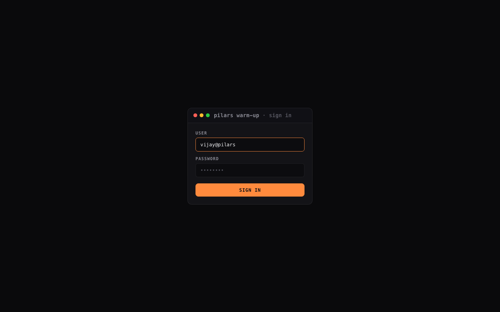

# Warmly — self-hosted email warm-up + AI auto-reply

**Live:** [pilars-warmup.vercel.app](https://pilars-warmup.vercel.app) (sign-in required)



A private warm-up engine for a pool of mailboxes you control. Mailboxes email
each other on a gradually increasing ramp; incoming warm-up mail is detected,
marked **read + important**, **rescued from spam**, and **auto-replied** to with
Claude-generated, human-sounding text on a randomized delay.

**Transport (this build):**

- **Send** via **Resend** (from your verified domains).
- **Detect + engage** via **Zoho IMAP** (poll each mailbox, mark read/important,
  move junk → inbox).
- **Replies** written by **Claude** (`claude-haiku-4-5`), sent back through Resend,
  correctly threaded (`In-Reply-To` / `References`).
- **State** in **Turso** (libSQL). **Runs on Vercel Cron** (every 15 min).

```
cron ──► send openers (ramp)  ──► Resend ──► lands in Zoho inbox
     ──► IMAP poll each box    ──► mark read/important, rescue from spam
                                └─► queue a delayed reply (Claude)
     ──► send due replies      ──► Resend (threaded)
```

### Why this shape (important)

Your mailboxes **receive** through Zoho (their MX records point at Zoho). Resend's
*inbound* webhooks would require repointing MX at Resend — which would **break your
real email**. So we never touch MX: Resend only **sends**, and we read inbound over
**IMAP**. Bonus: IMAP lets us mark read/important and rescue from spam — the
strongest reputation signals, which Resend inbound cannot do.

---

## Safety: it will never reply to real mail

Every warm-up email carries a secret header `X-Warmup-Token: <WARMUP_TOKEN>`.
The IMAP poller **only** engages/replies to messages that (a) carry that exact
token **and** (b) come from another pool address. Your real business email is
never read, flagged, moved, or answered. Keep `WARMUP_TOKEN` unguessable.

---

## Setup

### 1. Resend — verify sending domains

Add and verify each **sending** domain in Resend (DKIM CNAMEs + a `send.`
return-path). This does **not** change your MX / does not affect Zoho receiving.

- `thepilars.com`, `pilarsworks.com`, `hellopilars.com`, `meetpilars.com`

Create an API key → `RESEND_API_KEY`.

### 2. Zoho — enable IMAP + app passwords (per mailbox)

For each of the 5 mailboxes:

1. Sign in to that mailbox → **Settings → Mail Accounts → IMAP Access → Enable**.
2. **Settings → Security → App Passwords → Generate** (label it "warmup").
   (If the account has 2FA, the app password is required; a normal password
   won't work over IMAP.)
3. Note the DC: these accounts are on **`imap.zoho.in`** (India). Global-DC
   accounts use `imap.zoho.com`.

Put the app passwords in `.env.local` (they are read by the seed script, never
committed):

```
IMAP_PASS_BIJAY=...
IMAP_PASS_COLLAB=...
IMAP_PASS_SOLUTIONS=...
IMAP_PASS_TEAM=...
IMAP_PASS_VIJAY=...
```

### 3. Turso

```
turso db create warmly
turso db show warmly --url          # -> TURSO_DATABASE_URL
turso db tokens create warmly       # -> TURSO_AUTH_TOKEN
```

### 4. Environment

Copy `.env.example` → `.env.local` and fill in:

| var | what |
|-----|------|
| `TURSO_DATABASE_URL`, `TURSO_AUTH_TOKEN` | Turso |
| `RESEND_API_KEY` | Resend send key |
| `ANTHROPIC_API_KEY` | Claude replies |
| `WARMUP_TOKEN` | unguessable secret (safety gate) |
| `IMAP_HOST` | `imap.zoho.in` |
| `CRON_SECRET` | protects `/api/cron` (Vercel sets this header automatically) |
| `ADMIN_TOKEN` | bearer token for `/api/mailboxes` |

Ramp knobs (`WARMUP_START_PER_DAY`, `WARMUP_DAILY_INCREMENT`, `WARMUP_MAX_PER_DAY`,
`WARMUP_REPLY_PROBABILITY`, send-window hours, etc.) are documented in
`.env.example`.

### 5. Install + seed

```
npm install
npm run seed        # inserts the 5 mailboxes + IMAP creds
```

### 6. Try one tick locally

```
npm run tick        # runs send + poll + reply once, prints stats
npm run dev         # dashboard at http://localhost:3000
```

The dashboard has a **Run tick now** button, a live pool-network graph, a 14-day
volume chart, per-mailbox ramp bars, and an auto-refreshing activity feed.

---

## Deploy (Vercel)

```
vercel            # link project
vercel env add    # add each var above (Production)
vercel --prod
```

`vercel.json` registers the cron: `GET /api/cron` every 15 min. Vercel sends
`Authorization: Bearer $CRON_SECRET` automatically, which the route checks.

> Protect the dashboard: the `/` page and `/api/run` are same-origin/unauth for
> convenience. Put the project behind **Vercel Authentication** (Project →
> Settings → Deployment Protection) so only you can see it.

---

## How the ramp works

`daily_target = clamp(START + floor(days_active × INCREMENT), 1, MAX)`

Each 15-min tick sends only the *deficit* needed to stay on the day's curve,
paced across a human-looking send window, in small bursts. Not every received
email gets a reply (`WARMUP_REPLY_PROBABILITY`), replies fire after a random
`3–45 min` delay, and threads stop auto-replying past `WARMUP_MAX_THREAD_DEPTH`
to avoid infinite ping-pong.

## Adding / removing mailboxes

- Add: edit `scripts/seed.ts` (+ app-password env) and `npm run seed`, or
  `POST /api/mailboxes` with `Authorization: Bearer $ADMIN_TOKEN`
  `{ "email": "...", "display_name": "...", "imap_pass": "..." }`.
- Remove: `DELETE /api/mailboxes?email=...` (soft-deactivates; history kept).

## Files

```
lib/db.ts          Turso client + schema
lib/config.ts      env-driven tuning + ramp formula
lib/resend.ts      send via Resend
lib/imap.ts        Zoho IMAP: fetch warm-up mail, engage, rescue from spam
lib/reply-gen.ts   Claude opener/reply generation
lib/warmup.ts      engine: runSends / runInboundPoll / runPendingReplies / stats
app/api/cron       scheduled tick (Vercel Cron)
app/api/run        manual tick (dashboard button)
app/api/stats      dashboard data
app/api/mailboxes  admin CRUD
app/page.tsx       the live console
scripts/seed.ts    seed the pool
scripts/tick-local.ts  run one tick from the CLI
```

## Deliverability notes

- A pool of 5 is a small warm-up — fine to start; real reputation gains want more
  volume and more time. Grow `WARMUP_MAX_PER_DAY` slowly.
- Warm-up helps, but reputation ultimately follows *real* recipient behavior.
  Keep actual send content clean and low-complaint.
- The schema is provider-agnostic (`imap_host`/`imap_port` per mailbox), so you
  can later add Gmail/Outlook/other IMAP inboxes to widen the pool.
